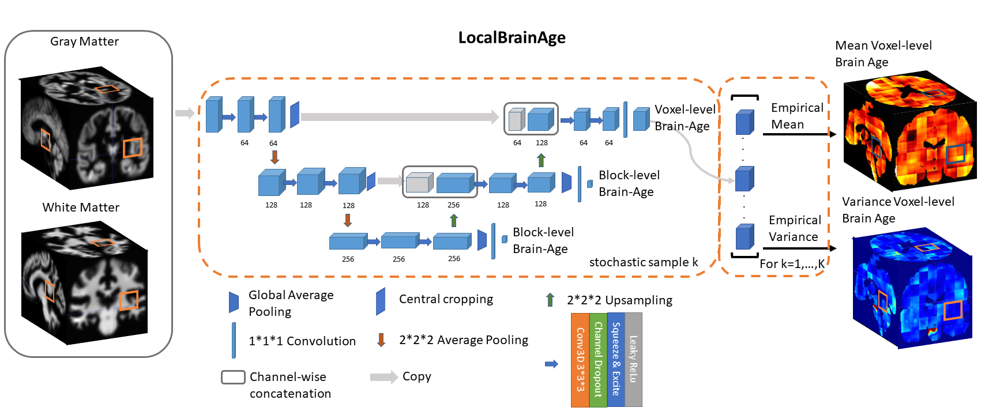

>📋  Accompanying code for "A U-Net model for Local Brain Age"

# A U-Net model for Local Brain Age

This repository is the official implementation of [A U-Net model for Local Brain Age](https://www.biorxiv.org/content/10.1101/2021.01.26.428243v1). 

>📋  

## Requirements

To install requirements:

```setup
pip install tensorflow-gpu==1.15.0
pip install nibabel
```

>📋  One also needs to install [spm12](https://www.fil.ion.ucl.ac.uk/spm/software/spm12/), besides CUDA 10.1 AND cuDNN 7.6.5 to enable GPU capabilities for Tensorflow

## Training

To train the model in the paper, run this command:

```train
python3 full_training_script.py --num_encoding_layers=2 --num_filters=64 --num_subjects=2 --num_voxels_per_subject=2 --location_metadata=$absolute_path_of_metadata_for_dataset --dirpath_gm=$absolute_path_of_directory_of_spm12_processed_gray_matter_nifti_files
--dirpath_wm=$absolute_path_of_directory_of_spm12_processed_white_matter_nifti_files --dataset_name=$dataset_name
```

>📋  The above command line function start training the U-Net model provided a dataset that already went through spm12's Dartel pipeline. One can get the folder with gm and wm nifti files by using  batched_spm12_dartel(img_dir, name_of_dataset, size_batch) function inside dartel_pipeline.py. We mention that the training process is quite lengthy (around 3 weeks on a GPU) if one wants the best possible performance.

## Evaluation

To evaluate our already trained U-Net model on your dataset you need run the following command (if python throws error such as too many files opened, just type ulimit -n 10000 on the command line)

```eval
ython3 full_testing_script.py --num_encoding_layers=2 --num_filters=64 --num_subjects=2 --num_voxels_per_subject=2 --location_metadata=$absolute_path_of_metadata_for_dataset --dirpath_gm=$absolute_path_of_directory_of_spm12_processed_gray_matter_nifti_files
--dirpath_wm=$absolute_path_of_directory_of_spm12_processed_white_matter_nifti_files --dataset_name=$dataset_name
```

>📋As mentioned in the paper, the brain scans have to go through the Dartel pipeline in spm12.  
>in "spm_brain_age_preprocess_b23d.m" you need to change "/data/my_programs/spm12" path to suit the location of where your local spm12 is installed. 
>In LocalBrainAge_testing.py the format of the .csv file containing meta-data has to have the following column names "Age", "Gender", "Subject", alternatively modify the code at lines 62-64.
>in your local spm12, you need to copy the files situated in the templates folder (Template_{1,2,3,4,5,6}.nii) to "$your_spm12_folder/templates/".

## Pre-trained Models

The pre-trained model is situated in the saved_model_3D_UNET_Dropout folder


## Citing this work

>📋 If you use these tools or datasets in your publications, please consider citing the accompanying paper with a BibTeX entry similar to the following:

```
@article{popescu2021u,
  title={A U-Net model of local brain-age},
  author={Popescu, Sebastian Gabriel and Glocker, Ben and Sharp, David J and Cole, James H},
  journal={bioRxiv},
  year={2021},
  publisher={Cold Spring Harbor Laboratory}
}

```


